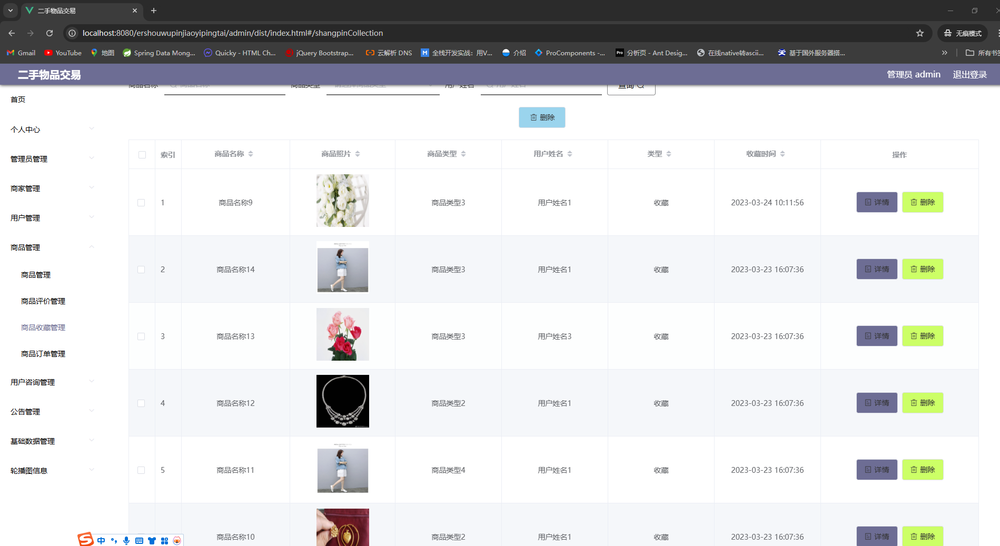

适合初学同学练手项目，部署简单，代码简洁清晰；

注:当前项目架构使用前后端未分离哦！

# 一、系统架构

######      前端：layui| html

######      后端：springboot | mybatis-plus   

######      环境：jdk1.8+ | mysql | maven

# 二、代码及数据库

#

#

# 三、功能介绍

#### 1.管理端

超管登录

###### (1).登录

###### (2).个人中心-修改密码

###### (3).商家管理

###### (4).用户管理

###### (5).商品管理

###### (6).商品评价

###### (7).商品收藏管理

###### (8).商品收藏管理

###### (9).用户咨询管理

###### (10).公告管理

(11).基础数据管理

(12).轮播图管理

商户登录同以上部分功能;

###### 2.用户端

###### （1）.登录

###### （2）.首页

###### (3).公告

###### (4).商家列表

###### （5）.商品列表

###### (6).个人中心

###### (7).购物车

